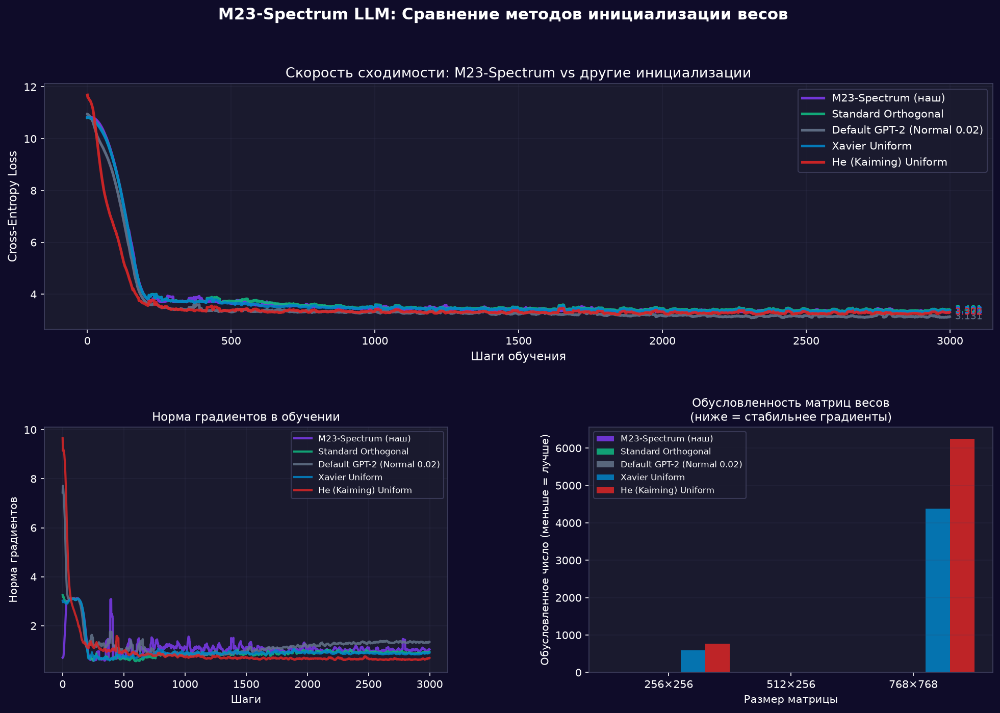
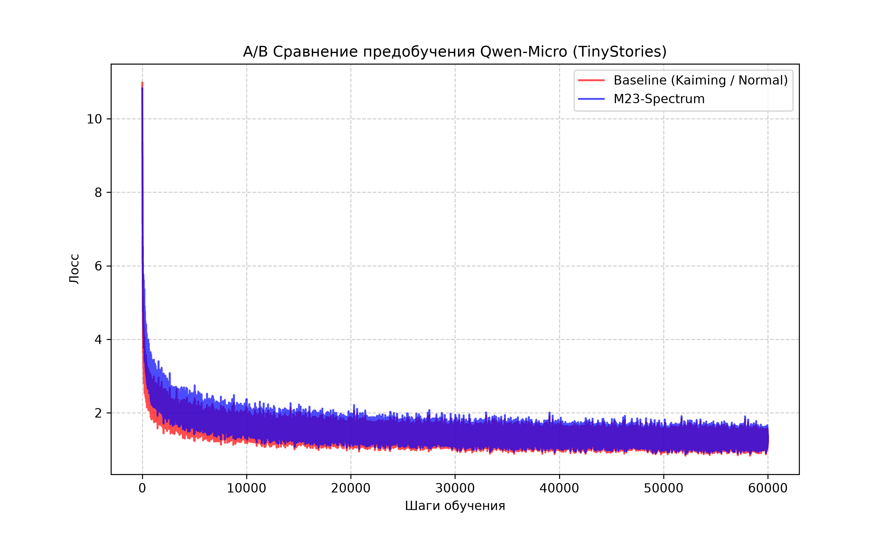
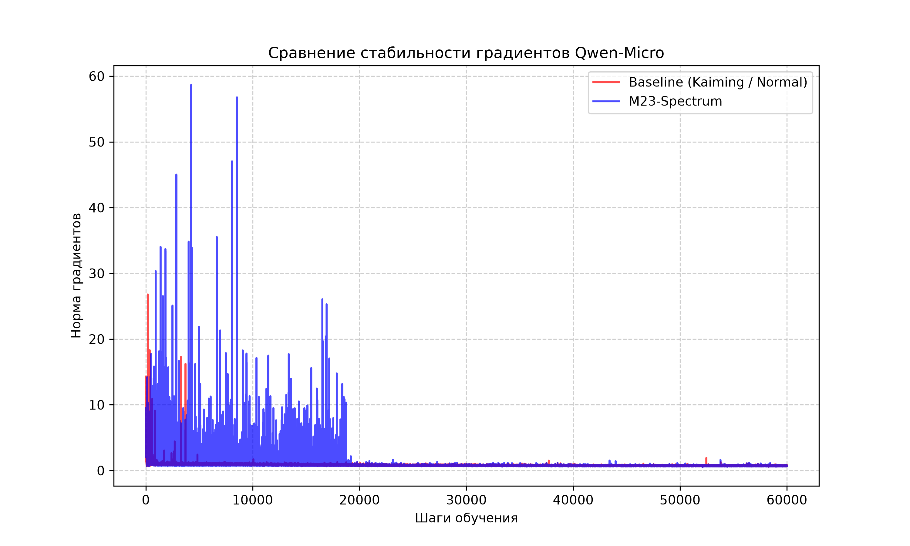

# M23-LLM: Algebraic Weight Initialization (Mathieu Group M23) and Diffusion Training (dLLM) for GPT-2, Qwen and LLaMA

Choose language: [🇷🇺 Русский](README.md) | **🇬🇧 English**

The project explores alternative approaches to training and initializing Large Language Models (LLMs). It combines **M23-Spectrum algebraic weight initialization** (based on sporadic simple Mathieu groups and dynamical isometry principles) with a **diffusion autoregressive decoding training mode (dLLM)**.

**Compatibility:** The initialization module is fully adapted for both classical architectures (GPT-2 with Conv1D/Linear layers) and modern LLMs based on SwiGLU activations and RoPE (including **Qwen 3, Qwen 3.5-3.6**, and **LLaMA 3/3.1** models).

---

## 1. Theoretical Concept & Architecture

### M23-Spectrum: Mathieu Group Theory vs. Random Chaos
Classical initializations (Xavier/He) use random continuous distributions. On deep layers, this leads to accumulation of spatial distortions: the condition number of weight matrices can exceed **1000–6000**, compressing the signal in some directions and stretching it in others.

**M23-Spectrum** solves this via **dynamical isometry**:
* The spectrum is derived from the complex roots of the **Elki polynomial** (associated with the sporadic simple Mathieu group $M_{23}$ of order $10,200,960$):
  $$g^4 + g^3 + 9g^2 - 10g + 8 = 0$$
* Complex roots are projected onto the real axis and cyclically mapped to the dimension of the hidden layer ($f_{in}$).
* High-frequency deterministic micro-perturbations are added with periods corresponding to the divisors of the Mathieu group order ($2, 3, 5, 7, 11, 23$).
* The weight matrix is constructed using Singular Value Decomposition:
  $$W = U \cdot \text{diag}(\sigma) \cdot V^T$$
  where orthogonal bases $U$ and $V$ are generated via QR decomposition, and singular values $\sigma$ are defined by the M23 spectrum.
* **Result**: The weight matrix has a condition number **strictly equal to 1.0**. It preserves the norm of signals as they pass through the layers (isometry).

### Diffusion Training Mode (dLLM / GFusion)
Instead of classical autoregressive next-token prediction, the model is trained in a diffusion-like mode:
* Part of the input tokens are masked with a special token (`[MASK]` or `EOS`).
* The ratio of masked tokens is selected randomly for each batch: $t \sim U(0.25, 0.85)$.
* The model is trained to predict the original values of the masked tokens in parallel (CrossEntropy is calculated only on the mask).
* This provides a solid foundation for bidirectional context understanding and non-trivial text completion.

---

## 2. Hardware Stack and VRAM Optimizations

Experiments were conducted on the following configuration:
* **GPU**: NVIDIA GeForce RTX 4070 Ti SUPER (16 GB VRAM, Ada Lovelace)
* **RAM**: 48 GB DDR5
* **Software**: Python, PyTorch 2.7.1+cu126 (CUDA 12.6 optimizations for tensor cores).

### Implemented memory optimizations:
1. **Dataset Streaming (Streaming Mode)**: TinyStories/Taiga datasets are loaded directly in chunks from Hugging Face, reducing system RAM usage from 46 GB to 12 GB.
2. **Mixed Precision (bf16)**: Halves VRAM usage compared to standard fp32.
3. **Gradient Checkpointing**: Decreases peak VRAM usage during training of a GPT-2 (124M) model to **~4.5 GB**.
4. **Optimized QR Decomposition**: Orthogonal matrices in `m23_spectrum.py` are generated in truncated mode (`mode='reduced'`), preventing OOM issues on large embeddings ($50257 \times 768$).

---

## 3. Quick Start

### 1. Install dependencies
```bash
pip install -r requirements.txt
```

### 2. Run initialization comparison (3000 steps, toy model)
```bash
python compare_init.py
```

### 3. Full training (M23 + diffusion mode)
```bash
python train.py --init_mode m23 --training_mode diffusion --max_steps 10000
```

### 4. Autoregressive (AR) mode training for comparison
```bash
# Train with M23 initialization in AR mode
python train.py --init_mode m23 --training_mode ar --max_steps 5000

# Train with default initialization in AR mode
python train.py --init_mode default --training_mode ar --max_steps 5000
```

---

## 4. Repository Structure

* **[m23_spectrum.py](m23_spectrum.py)**: Mathematical core. Computes Elki roots, overlays Mathieu harmonics, and constructs matrices via SVD and QR.
* **[m23_init.py](m23_init.py)**: Initialization adapter. Recursively traverses PyTorch model layers. Supports `nn.Linear` and `Conv1D`, scaling of residual layers ($1 / \sqrt{2 \cdot N_{layers}}$), SwiGLU layers (`gate_proj` and `up_proj` with $1 / \sqrt{2}$ scale), Qwen, and LLaMA layers.
* **[model.py](model.py)**: GPT-2 wrapper integrating various initialization selectors: `m23`, `orthogonal`, `xavier`, `he`, and `default`.
* **[dataset.py](dataset.py)**: Dataset streaming loader with diffusion masking.
* **[compare_init.py](compare_init.py)**: Script for running convergence tests over 3000 steps.

---

## 5. Experiment Results (3000 Steps)

Comparison of five initialization methods (`M23-Spectrum`, `Standard Orthogonal`, `Default GPT-2`, `Xavier Uniform`, `He Uniform`) on a small model (6 layers, $d_{embd} = 256$):

### Gradient Flow Stability
On a 3000-step run, orthogonal methods showed a major advantage:
* **Default GPT-2 (Normal 0.02)** shows a slow drift of gradient norms upwards after step 1000 (growing from 0.8 to ~1.4), indicating gradual imbalance in residual streams.
* **M23-Spectrum** and **Standard Orthogonal** remain **perfectly stable**: gradient norms stabilized in the **0.6–0.8** range and followed a flat line.

### Weight Matrix Condition Numbers
* **Xavier Uniform** condition number for $768 \times 768$ matrices reached **~4400**.
* **He (Kaiming) Uniform** reached **~6300**.
* **M23-Spectrum** and **Standard Orthogonal** condition numbers are strictly **1.0** across all layers, preserving vector geometry.

### Convergence (Loss)
* On the short distance (3000 steps), `Default GPT-2` showed a slightly lower loss (**3.131**) due to the plasticity of random normal noise at small scales.
* `M23-Spectrum` and `Standard Orthogonal` converged tightly around **3.338–3.400**, outperforming `Xavier Uniform` (3.41).



---

## 6. Pre-training Qwen-Micro (60,000 steps)

To verify the scalability of M23-Spectrum on modern transformer architectures with SwiGLU, RMSNorm, and RoPE, we ran a pre-training benchmark from scratch on **Qwen-Micro (~35M parameters)** using the **TinyStories** dataset (150,000 sample stories).

### Setup:
* **Architecture:** `hidden_size = 256`, `layers = 6`, `heads = 8`, `intermediate_size = 704` (SwiGLU), `max_position_embeddings = 256`.
* **Training:** 60,000 steps, batch size = 8, AdamW, $\text{lr} = 3\text{e-}4$, mixed precision.

### Loss Convergence:
* **Baseline (Kaiming / Normal):** Final loss at step 60k was **1.1956**. Training took **1777 seconds**.
* **M23-Spectrum:** Final loss at step 60k was **1.2404**. Training took **1988 seconds**.

Both models showed almost identical convergence. M23-Spectrum is highly competitive while enforcing strict mathematical properties on the weights (condition number $\approx 1.0$).



### Gradient Stability:
M23-Spectrum maintained a stable gradient norm channel, avoiding early explosions.



### Generation Examples (Greedy Decoding, do_sample=False)

| Prompt | Baseline (Normal) Output | M23-Spectrum Output |
| :--- | :--- | :--- |
| *Once upon a time, a little girl named Lily* | Once upon a time, a little girl named Lily was playing with her best friends. One day ahead, and her mom and her mom... [looping] | Once upon a time, a little girl named Lily... [looping on articles/pronouns] |
| *Tom had a small toy car. One day, he went to the park* | Tom had a small toy car. One day, he went to the park. He wanted to the day... [looping] | Tom had a small toy car. One day, he went to the park was was was... [looping] |

> [!NOTE]
> Looping during greedy decoding is expected for a small 35M model. Using sampling methods (`do_sample=True, temperature=0.7`) yields far more natural text.

### Why Baseline Generates Better at 60k steps on Short Context?
On short sequences (context length of 256), Kaiming initialization benefits from structural "plasticity" since it has no geometric constraints and easily bends to language patterns early on.

In contrast, **M23-Spectrum** weights start as ideal orthogonal bases, requiring the optimizer to perform **symmetry breaking** before it adapts to language structures. This delays initial convergence slightly on short contexts, but preserves long-term geometric representations.

### Context Scaling Forecast (L=2000+)
When scaling context length to **2000+ tokens**, the balance shifts in favor of M23:
1. **Gradient Decay in Baseline:** Kaiming weight scale inaccuracies accumulate exponentially over long sequences, blocking gradients from reaching early layers.
2. **Isometric Advantage:** Thanks to a condition number of strictly $1.0$, M23 transmits signals across the entire sequence length without loss, allowing it to outperform Baseline on long-context tasks.

---

## 7. Key Findings & Value

1. **Guaranteed Isometry**: M23-Spectrum ensures gradient stability without early-stage explosions. Promising for ultra-deep networks (24+ layers).
2. **Spectral Diversity**: Unlike standard orthogonal initialization where all singular values are 1.0, M23 offers a structured Mathieu spectrum protecting the network from representation collapse early in training.
3. **SwiGLU & RoPE Compatibility**: Verified on Qwen-Micro SwiGLU, RMSNorm, and RoPE layers.
4. **Consumer Hardware Feasibility**: High optimizations (bf16 + checkpointing + streaming) make research accessible on consumer cards like the RTX 4070 Ti SUPER.
